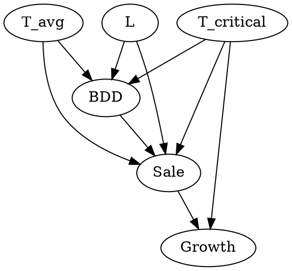

# Weather impact on retail sales: How weather derivatives help with adverse weather deviations.

## Abstract

Weather affects four basic purchasing decisions: what, where when and how much.
Retailers lack detailed knowledge that can guide decision making. Weather sensitivity analysis can help with this.
Customized weather derivatives are suggested to offset failed sales due to weather effects.
A panel method was used to analyse the data (segmentation)
Sensitivity has a monthly variation, which implies different risk management strategies.
Lagged and lead effects describe buying behaviours.

## Introduction

Weather sensitivity can be analyzed through sales, production and costs. It is tied to meteorological elements. Sensitivity exists if there is volatility due to weather changes (high coefficients in regression).

Weather risk (include definition here...)

There are two different kinds of weather events that can happen: catastrophic (low probability with high impact), and non-catastrophic (minor deviations from the usual).

Weather sensitivity must be done by product.

Weather cannot be predicted with the required accuracy to make decisions. That is why it is helpful to have compensation mechanisms related to weather.

Weather sensitivity analysis has the following goals:

- determine the elements that impact weather sale.
- quantify weather risk exposure.
- design weather risk protection tools

## Weather sensitivity on retail

Unfavorable weather can have consequences such as

- consumers defer purchases because of inconvenience
- reduced mobility
- may reduce sales on larger, far away locations; while increasing sales on smaller and closer ones.

High-level analysis nullifies the impact of weather, that's why it is important to do weather sensitivity analysis on a product by product basis.

The weather may have permanent or temporary effects. Permanent effects may describe impulsive buying.

Effects vary between months and group categories.
Weather events with negative effects on sales: temperature, sunshine
Weather events with negative effects on sales: rain, wind, snow.

## Research design and methodology

The study was done among homogenous groups of stores and product categories. Climatological homogeneous grouping was demonstrated.

A multiple linear regression was done over two dimensions (panel analysis):

- cross-sectional (food stores)
- temporal (days)

Important variables (codebook)
A regression was made for (item, day, month)
sale -> volume
temperature -> avg °C
sun -> daily sunshine hours
rain -> mm of rain
location -> dummy variable encoding measurement
pre_holiday, holiday, post_holiday -> binary
weekend -> binary
size -> size in m^2

Regression was made with Time Series Cross Section. (TSCS)
Used Panel Corrected Standard Errors (PCSE)

**statistical tests**

- Dickey-Fuller => Freedom from spurious correlations
- Wooldridge => autocorrelation
- Lagrange Multiplier => contemporaneous correlation

## Results and discussion

Correlation sigs vary by month.
Relation is stronger in some months than others.
A semi-logarithmic model was also fitted to check the % increase in beverages as a result of 1°C increase in average daily temperature.
The relationship might be non-linear.
The issue of a critical threshold temperature was also introduced. What if it were a critical temperature thresold that would indicate an accelerated growth of sales.

Framed as a causal model:

Lagged and Lead Effects were also discussed.

Lagged effects: include past temperatures as coefficients in the prediction of sales
Lead effects: future temperatures might have an effect on the current temperatures

Effect coeficient interpretation

- positive: consumers may be buying ahead due to precautions.
- negative: delayed wash-out effect (people are still consuming from the past)

## Designing a Hedge against adverse temperature deviations using weather derivatives

Derivatives offer indemnity in the case of adverse weather.

### Components

- Start and end of a contract period
- measurement station
- weather measured at the station over the period
- pay-off function
- weather index: aggregate the weather over th period
- premium: seller to buyer

Settlement on maturity: deviation of weather index in the context of a strike index.
Strike index: expected value of weather (average over time)

Applications:

- covering highly sensitive months
- reducing sales uncertainty

Pay-off function
p(W) = max [0, T x (S - W)] - P

T: tick (value multiplier of weather sensitivity). It represents the change in sales volume caused by unit change in the underlying weather index.
W: Weather Index
S: Strike value
P: amount of premium

## Managerial Implications

Weather sensitivity can lead to interesting actions:

- if the correlation is low in the month, campaigns can be introduced to promote attendance to the shopping site
- if the correlation is high, on-site activations can be done to stimulate consumers to buy more.

Weather sensitivity can help in the isolation of the impact of temperatures on sales. It such effects can be isolated, then it's easier to evaluate the effectiveness of other interventions.

## Conclusion

- Sensitivity varies by period, category and store type
- Deductive conclusions don't work. A case by case, stratified analysis must be performed.
- There is a correlation between temperature and sales. Is it causal?
- Lead and lagged effects were also studied.
- The impact of temperature in a current day (no lagging effect) implies impulsive buying
- Weather derivatives can work as a risk mitigation solution.
- A framework to design them is explained.

Future work:

- joint effects
- non-linearity relationship between weather and sales
